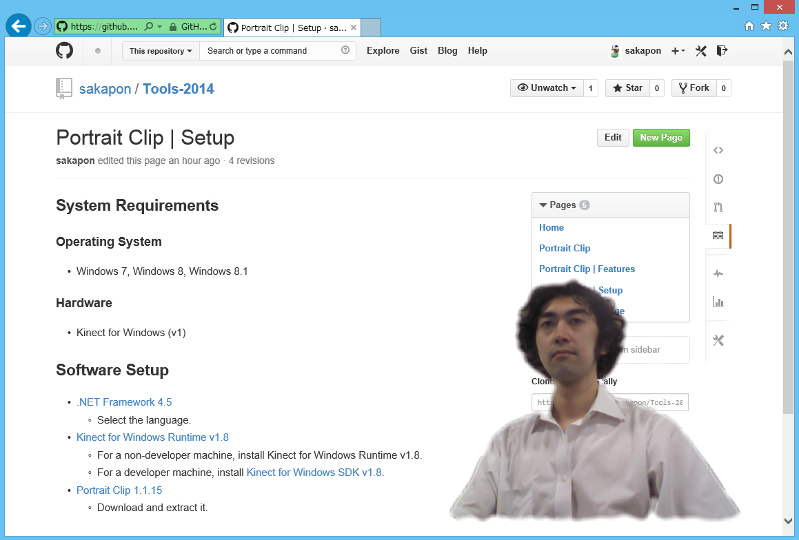

# Tools 2014

The project to create tools.

## [Portrait Clip](https://github.com/sakapon/Tools-2014/wiki/Portrait-Clip)
The desktop app to clip a person (remove background) from the camera capture, using Kinect for Windows.

